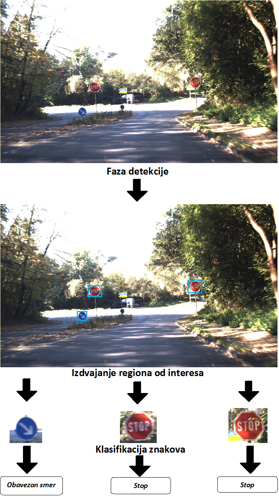

# TDSC : Traffic Sign Detection and Classification

### Soft Computing 2016 | Viktor Šanca, viktor.sanca@uns.ac.rs
---

## Sadržaj
---

* [Uvod](#uvod)
* [Skup podataka](#podaci)
* [Postupak](#postupak)
    * [Sliding window + klasifikator zasnovan na KNN](#cnn_naive)
    * [Haar kaskadni klasifikator](#haar)
    * [Konvolutivna neuronska mreža](#cnn)

---

## Uvod<a name="uvod"></a>

Sistemi za podršku vozačima motornih vozila razvijaju se dugi niz godina, u skladu sa tehničkim i algoritamskim dosegom problema koji takvi sistemi mogu da umanje ili prevaziđu. Zajednički cilj takvih sistema je povećavanje bezbednosti učesnika u saobraćaju svođenjem greške uzrokovanu ljudskim faktorom na minimum, dok je posledica često i povećanje komfora vozača.

Neki od ranih složenih sistema jesu prepoznavanje napuštanja trake vozača, gde se pratila linija koja određuje traku vozača i davalo taktilno i zvučno upozorenje vozaču, sa ciljem smanjivanja nezgoda zbog napuštanja trake nastalog dekoncentracijom ili umorom vozača. 

Tehničkim i naučnim napretkom u oblasti računarske obrade i semantičkog procesiranja slike otvorene su nove mogućnosti za primenu tehnika računarske inteligencije. Korak koji automobilska industrija već aktivno preuzima jeste uvođenje nekog od stepena automatizacije vožnje, poput [Google Waymo automobila](https://waymo.com/) ili [Tesla autopilota](https://www.tesla.com/autopilot). 

Jedan od glavnih izazova izrade autonomnog sistema za vožnju jeste precizno prepoznavanje okruženja i saobraćajnih pravila koje u tom trenutku važe na deonici puta. Saobraćajna pravila i obaveštenja se najčešće saopštavaju vozaču posredstvom vertikalne signalizacije, odnosno saobraćajnih znakova. Potrebno je iz ulaznih podataka u vidu slike izvršiti semantičku obradu gde će se odgovarajući saobraćajni znak detektovati na slici i obraditi tako da je ponašanje sistema u skladu sa važećim propisima na toj deonici puta. 

Osnovna ograničenja ovakvih sistema jesu stepen pouzdanosti koji treba da je jednak ili viši ljudskoj sposobnosti prepoznavanja - *superhuman* i *real-time* obrada podataka. Nepostojanje jedinstvenog standarda koji propisuje moguće saobraćajne znakove različitih klasa i praktični problemi poput različitih vremenskih uslova, osvetljenosti, zaklonjenosti ili oštećenja znaka, kao i sličnosti u okviru iste klase znakova predstavljaju glavne prepreke u obučavanju ovakvih sistema. 

U praktičnom smislu deo autonomnog upravljanja može se ostvariti i parcijalnim prepoznavanjem određenih klasa saobraćajnih znakova koji su bitni za sigurno i bezbedno funkcionisanje sistema poput ograničenja brzine, znakova opasnosti, obaveznog zaustavljanja ili prvenstva prolaza. Pored problema nedetektovanja znakova, pouzdanost sistema zavisi i od uspešnog razlučivanja da li je znak lažno detektovan od strane sistema na osnovu tako obučenog sistema.

---

<h2><center>Uobičajeni tok algoritma za prepoznavanje i klasifikaciju objekata</center></h2>



---

## Skup podataka<a name="podaci"></a>

Skupovi podataka u vidu slika i video zapisa iz saobraćaja su dostupni. Podaci obuhvataju slike iz saobraćaja sa odgovarajućim anotacijama i slike samih znakova, klasifikovane po vrsti. 

Skup podataka koji je upotrebljavan u svrhe istraživanja je [German Traffic Sign Recognition Benchmark - GTSRB](http://benchmark.ini.rub.de/?section=gtsrb&subsection=news) i [German Traffic Sign Detection Benchmark - GTSDB](http://benchmark.ini.rub.de/?section=gtsdb&subsection=news). 

**GTSRB** skup podataka upotrebljen je za obučavanje klasifikatora samih znakova, i sastoji se od 50000 znakova u 42 klase.

**GTSDB** skup sastoji se od 900 slika iz saobraćaja sa anotacijama znakova, i sadrži i manji broj slika samih znakova u odgovarajućim klasama.

U pojedinim slučajevima bilo je neophodno generisati dodatne primere znakova, pre svega u slučaju obučavanja kaskadnog klasifikatora što je učinjeno na osnovu transformacija prethodnih skupova.

Sintetički skup moguće je generisati na osnovu proizvoljnog skupa slika bez znakova, pri čemu bi se znakovi iz **GTSRB** skupa uz primenjenu transformaciju veličine, stepena rotiranosti i osvetljenosti postavljali na pozadinu, čime se može efektivno generisati sintetički skup za validaciju ili obučavanje.

---

## Postupak<a name="postupak"></a>

Nekoliko pristupa je razmatrano za rešavanje problema detekcije i klasifikacije znakova sa slika. Apstrakt svakog pristupa biće predstavljen, dok je detaljna razmatranja moguće pronaći u odgovarajućim priloženim i linkovanim dokumentima gde su pristup i rezultati detaljnije objašnjeni. Više različitih pristupa izabrano je kako bi se uporedile performanse, kako vremenske tako i praktične u smislu preciznosti i pouzdanosti.


### Sliding window + klasifikator zasnovan na KNM<a name="cnn_naive"></a>

Konvolutivna neuronska mreža obučena je za klasifikaciju saobraćajnih znakova iz **GTSRB** skupa, sa preciznošću od ~97%. Sliding window princip predstavlja naivni pristup gde se jak klasifikator koristi na svakom uzorku slike, kako bi se na osnovu klasifikacije utvrdilo da li je region neki od znakova, u isto vreme utvrđujući i klasu znaka.

Zaključak i detaljna diskusija postupka nalazi se u [posvećenom dokumentu](SlidingCNN/SlidingCNN.ipynb).


### Haar kaskadni klasifikator<a name="haar"></a>

Kaskadni klasifikatori su istorijski upotrebljavani za detekciju objekata na slici. Kako bi detekcija objekata postala dovoljno jeftina operacija, ne koriste se mnogobrojne informacije o intenzitetu slike, poput RGB vrednosti, već se vrši jednokratna transformacija nad slikom. Jedna od transformacija koja se često koristi u detekciji objekata jeste izračunavanje [Haar karakteristika](https://en.wikipedia.org/wiki/Haar-like_features), čime se značajno ubrzava postupak detekcije i obrade.

Kaskadni klasifikator zasnovan na Haar karakteristikama obučen je na osnovu slika znakova pruženih u **GTSDB** skupu, dok je za skup negativnih slika upotrebljavan skup proizvoljnih slika bez saobraćajnih znakova.

Detaljnije o postupku i rezultatima u [posebnom dokumentu](HaarDetector/HaarDetector.ipynb).


### Konvolutivna neuronska mreža<a name="cnn"></a>

Konvolutivna neuronska mreža koja se zasniva na [GoogLeNet-OverFeat](https://arxiv.org/pdf/1506.04878.pdf) algoritmu koji je jednostavan i robustan za prepoznavanje elemenata slike. Za razliku od sliding windows pristupa, na optimalniji način se vrši segmentacija i detekcija objekata, čime se omogućavaju mnogo bolje praktične performanse.

Više detalja i diskusija o ovom pristupu nalazi se u [dokumentu](TensorDetector/TensorDetector.ipynb).


---


```python

```
