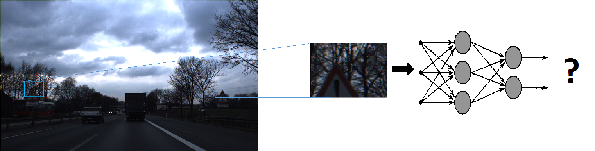
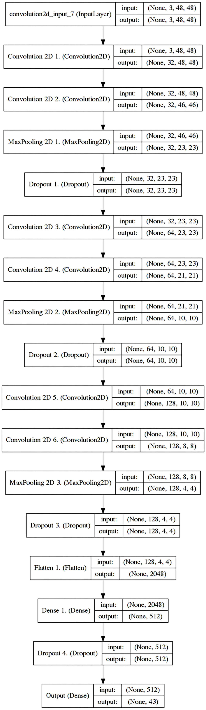
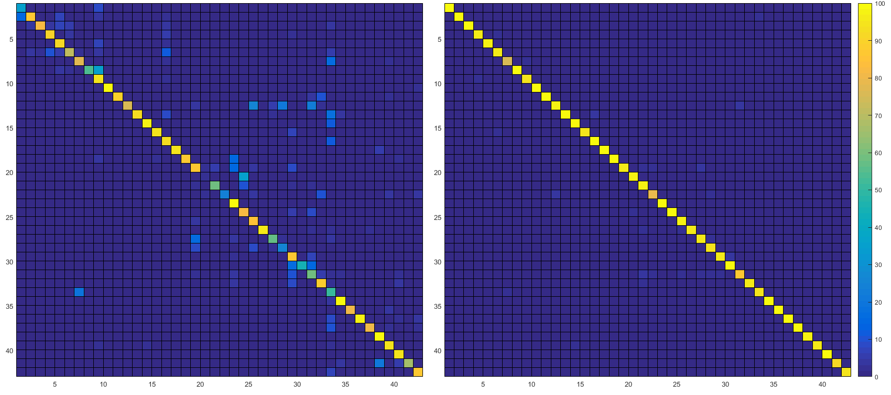
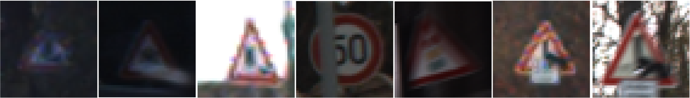

# TSDC - Sliding window + klasifikator znakova (KNM)

---

## Motivacija

Konvolutivne neuronske mreže pokazuju izuzetno dobre rezultate u klasifikaciji podataka, posebno u oblasti klasifikacije objekata na slikama. Obučavanje na dovoljno velikom skupu podataka koje je vrlo često veoma dugotrajno, rezultuje klasifikatorom koji je pretežno robustan, u zavisnosti od podataka koji su pohranjeni.

Činjenicu da je moguće obučiti efikasan klasifikator idejno je moguće upariti sa problemom detekcije objekta na sceni. Osnovna ideja je segmentacija slike, odnosno pravljenje klizajućeg prozora koji bi segmente slike pružao kao ulaz u klasifikator, a u zavisnosti od izlaza bi se utvrdilo da li se u tom regionu nalazi objekat od interesa.

<h2>
Predloženi tok algoritma
</h2>

### Algoritam

1. Učitavanje slike od interesa
2. Učitavanje neuronske mreže
3. Obrada slike tako da odgovara očekivanom ulazu u NM
4. Zadavanje veličine klizajućeg prozora
5. Zadavanje pozicije prozora
6. Ekstrakcija podataka iz prozora
7. Prilagođavanje veličine ulaza za NM
8. Obrada podataka u NM
9. Provera pouzdanosti predikcije i klase
10. Ponoviti korak 5. do završetka iteracije
11. Ponoviti od koraka 4. za različitu veličinu prozora

---

## Neuronska mreža

Zadatak neuronske mreže je klasifikacija slika veličine 48x48 u jednu od 43 kategorije saobraćajnih znakova. Skup podataka u vidu 50000 saobraćajnih znakova koji su upotrebljeni za obučavanje i validaciju deo je skupa **GTSRB** i sastoji se od već izdvojenih slika znakova koji su već klasifikovani, kao i određenog broja neklasifikovanih znakova za validaciju.

Kao platforma za razvoj neuronske mreže upotrebljena je *Theano* i *Keras* biblioteka, dok se za obradu slike upotrebljava *Scikit* zbirka biblioteka, u programskom jeziku *Python*.

Postavljen je model duboke neuronske mreže sa konvolutivnim slojevima. **Model neuronske mreže nalazi se na slici, desno**. Radi minimizovanja funkcije cilja korišćena je optimizacija stohastičkim opadajućim gradijentom, brzina obučavanja 0.01, *decay* 10-6, a momenat 0.9.

Skup podataka za obučavanje je obrađen tako što je slikama promenjena veličina na 48x48 i prevedene su iz RGB domena u *grayscale* domen. *Kako bi testiranje i upotreba mreže bila uspešna, potrebno je obezbediti da su ulazni podaci uvek u ovom formatu*.

Validacija je izvršena na osnovu testnog skupa i provere da li je mreža klasifikovala znak u prethodno anotiranu kategoriju. U zavisnosti od epoha, pouzdanost klasifikacije varirala je od 84.62% za jednu epohu, do 97.47% za dvadeset epoha. Kako bi se umanjila verovatnoća overfitovanja mreže, podaci su nasumično pomešani pre faze obučavanja. Confusion matrice upotrebljene su kako bi se utvrdila pogrešno klasifikovana kategorija, a dat je pregled za matrice nakon jedne, odnosno 20 epoha:

Inspekcijom pogrešno klasifikovanih znakova može se doći do zaključka da se radi o znakovima koji su delimično zaklonjeni ili gde je kvalitet slike značajno narušen tako da ni ljudskim zaključivanjem nije moguće odrediti klasu znaka. Neki od primera pogrešno klasifikovanih znakova su ilustrovani: 

Na osnovu validacije na 12630 slika moguće je zaključiti da je neuronska mreža uspešno obučena za detekciju saobraćajnih znakova definisanih obučavajućim skupom.

Dodatne informacije i objašnjenje moguće je videti i na [posteru](vs_cnn.pdf), gde su performanse upoređene sa pristupom klasifikaciji upotrebom Support Vector Mašine (SVM) na ekstrahovanim osobinama slike u vidu histograma orijentisanih vrednosti (HOG).

---

## Sliding window i detekcija

---

## Diskusija

---
